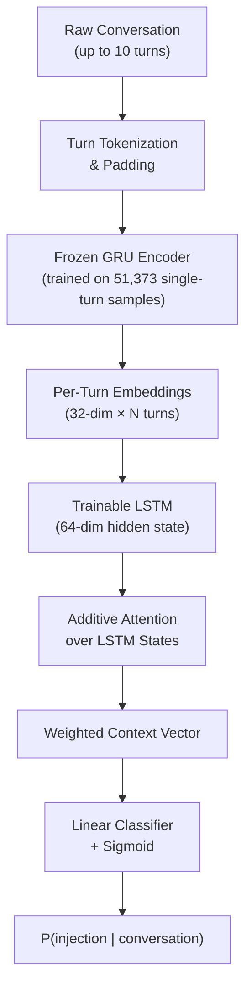

# Architecture Decisions

This document explains the architectural choices made during development of the multi-turn prompt injection detection system. Each section covers a specific decision, the alternatives considered, and the empirical or theoretical basis for the chosen approach.

---

## Overview

The system uses a dual-encoder architecture that separates two classification problems: detecting attack signals within individual turns, and detecting distributed attack patterns across a conversation.

The decomposition is deliberate. The frozen turn encoder is trained on abundant single-turn data (51,373 samples) and learns to produce informative per-message representations. The trainable sequence classifier is trained on scarcer multi-turn conversation data (5,000 conversations) and learns to recognize conversation-level attack patterns from those representations. This separation ensures each component trains on data matched to its task, avoiding the data-starvation problem that would arise from training a single end-to-end model on multi-turn data alone.

---

## Encoder Selection

Four encoder architectures were evaluated on the single-turn classification task before the best was frozen for use in the multi-turn system.

| Iteration | Model | F1 | Notes |
|-----------|-------|----|-------|
| 1 | LSTM | 0.8143 | Random embeddings, 64-dim hidden |
| 2 | LSTM + GloVe | 0.8134 | Pretrained embeddings |
| 3 | BiLSTM + Dropout | 0.8145 | Bidirectional, dropout=0.3 |
| 4 | GRU | 0.8151 | Fewer parameters, no cell state |

GRU was selected as the encoder for three reasons. First, it achieves the highest single-turn F1 (0.8151). Second, it has fewer parameters than the LSTM variants because it eliminates the separate cell state vector, retaining only a gating mechanism over hidden state. Third, the reduced parameter count lowers computational cost at inference time, which matters when the frozen encoder runs once per turn across potentially long conversations.

The GloVe-initialized LSTM (iter 2, F1=0.8134) performed worse than randomly initialized embeddings. This result is consistent with domain mismatch: GloVe embeddings are trained on general-domain text, while prompt injection data contains specialized imperative structures and adversarial phrasing that differ substantially from the GloVe training distribution.

Dropout of 0.3 was selected from the iter 3 comparison (0.3 vs 0.5), where 0.3 produced better generalization. This value carries forward into later iterations.

---

## Chollet Heuristic Analysis

Before committing to sequence models, this project followed the heuristic from Chollet's *Deep Learning with Python* (Chapters 11 and 15): the appropriate model family for a text classification task depends on the ratio of training samples to mean sequence length.

- Training samples: 51,373
- Mean words per sample: 87.3
- Ratio = 51,373 / 87.3 = **588**
- Threshold: below 1,500 favors bag-of-bigrams models; above 1,500 sequence models become competitive; well above 1,500 transformers win

The ratio of 588 falls well below the sequence-model threshold. The following results confirm this:

| Model Family | Best F1 | Parameters |
|-------------|---------|------------|
| TF-IDF + Random Forest (BoW) | 0.834 | n/a |
| GRU (sequence) | 0.815 | 2.6M |
| Custom Transformer | 0.808 | 2.8M |
| DistilBERT (99K trainable) | 0.806 | 66M total |

The bag-of-words baseline outperforms all neural approaches on single-turn classification. The Custom Transformer uses 2,833,281 parameters; DistilBERT has 66M total parameters with 98,561 trainable during fine-tuning.

The practical conclusion: model family selection should follow the data, not current trends. At a ratio of 588, investing in transformer architectures yields no benefit over a well-tuned TF-IDF + Random Forest pipeline on single-turn data. The value of deep learning in this project emerges only in the multi-turn setting, where temporal patterns across a conversation cannot be captured by bag-of-words features regardless of how the features are weighted.

---

## Multi-Turn Architecture

The core empirical finding of this project is the performance gap between single-turn and multi-turn models on conversation-level injection detection.

| Model | F1 |
|-------|----|
| Single-turn GRU applied per-turn (no sequence context) | 0.887 |
| Multi-turn LSTM — iter 5 (sequence context) | 0.989 |
| With attention — iter 6 | 0.992 |
| With threshold tuning — iter 7 | 0.995 |

The gap between the single-turn GRU (0.887) and the multi-turn LSTM (0.989) is **+10.2 F1 points**. This gap is not attributable to model capacity or architecture quality — the single-turn GRU is a competitive model that outperforms transformers on individual turns. The gap is attributable to the absence of temporal context. Distributed attacks fragment their payload across multiple turns; evaluating each turn independently misses the pattern.

Design details of the multi-turn architecture:

- The frozen GRU encoder produces **32-dimensional** turn embeddings (half the 64-dim hidden state, via a projection layer).
- The trainable sequence LSTM reads up to **10 turns** per conversation with a **64-dimensional hidden state**.
- The sequence classifier has approximately **27,000 trainable parameters** — small enough to train on 5,000 multi-turn conversations without overfitting.
- The frozen GRU parameters are not updated during multi-turn training, preventing catastrophic forgetting of single-turn features.

---

## Attention Mechanism

The sequence LSTM is augmented with additive (Bahdanau-style) attention over its hidden states. At each position in the conversation, the attention mechanism computes a scalar importance weight. The weighted sum of hidden states forms the context vector passed to the classifier.

Attention serves two purposes. The primary purpose is performance: F1 improves from 0.989 to 0.992 by allowing the classifier to weight the most diagnostic turns more heavily than conversational filler. The secondary purpose is interpretability: security analysts can inspect the per-turn attention weights to understand which messages most influenced a detection decision, supporting triage and response workflows.

The attention module is implemented in `src/models/attention.py`.

---

## Threshold Tuning

In security applications, false negatives (missed attacks) carry substantially higher operational cost than false positives (false alarms requiring analyst review). The default decision threshold of 0.5 treats both error types equally, which is inappropriate for this domain.

The threshold was tuned over a sweep on the validation set. The optimal threshold is **0.64**, shifting the decision boundary toward higher confidence requirements before classifying a conversation as benign. F1 improves from 0.992 (at threshold 0.5) to **0.995** (at threshold 0.64).

Final confusion matrix on the 1,000-conversation held-out test set:

|  | Predicted Benign | Predicted Attack |
|--|-----------------|-----------------|
| **Actual Benign** | 498 TN | 2 FP |
| **Actual Attack** | 3 FN | 497 TP |

The 3 false negatives warrant examination. They represent attacks that were distributed so gradually across turns — with each individual turn appearing entirely benign — that even with sequence context the model assigns cumulative probability below 0.64. These edge cases motivate future work on longer context windows and turn-level anomaly scoring.

---

## Ablation Studies

Seven ablation variants are implemented in `src/models/ablations.py` to establish which components of the architecture are necessary for strong performance.

| Ablation | What It Tests |
|----------|---------------|
| Shuffled turns | Whether turn order matters (random permutation at test time) |
| Reversed turns | Whether attack directionality matters |
| Mean pooling | LSTM replaced with mean of turn embeddings |
| Max pooling | LSTM replaced with max of turn embeddings |
| Autoencoder | Unsupervised turn representations vs supervised GRU |
| Prefix-only | Detection using only the first N turns |
| Continuation | Detection using only the last N turns |

The shuffle and reversal ablations are the most theoretically important. A model that learns genuine temporal patterns should degrade when turn order is destroyed. A model relying on lexical features of individual turns should be unaffected. The pooling ablations establish the contribution of the recurrent sequence model over simpler aggregation strategies.

---

## Confound Gates

Before trusting the multi-turn model's performance numbers, three confound tests validate that the model is not exploiting shortcuts.

**Null calibration** (`results/null_calibration.json`): synthetic conversations are generated using the same templates as the training set but with labels randomized. The BoW overlap score mean is 1.0 (expected: template-based generation produces high lexical overlap regardless of label), and the voting score mean is 0.679. These calibration values confirm that the model's high F1 is not explained by simple lexical overlap between training and test conversations.

**Shared-prefix testing**: attack and benign conversations are constructed to share identical opening turns, with the attack payload introduced only in later turns. This forces the model to discriminate based on later conversational context rather than any distinguishing features in the opening. Implementation: `src/data/shared_prefix_generator.py`.

**Validation gates**: the full confound gate suite is implemented in `src/data/confound_gates.py` and runs as part of the evaluation pipeline before any multi-turn results are reported.

---

## Data Design Decisions

Multi-turn injection conversations are synthetic, generated using four strategies based on published research on adversarial prompt patterns.

| Strategy | Distribution | Description |
|----------|-------------|-------------|
| Fragment distribution | 40% | Split injection payload across turns, interleave with benign |
| Gradual escalation | 30% | Crescendo pattern (Russinovich et al., USENIX Security 2025) |
| Context priming | 20% | Establish persona or authority, exploit in later turns |
| Instruction layering | 10% | Cumulative constraint override across turns |

Fragment distribution dominates (40%) because it is the hardest attack class for single-turn detectors: no individual turn contains a complete injection payload. Gradual escalation (30%) is weighted second-highest based on the Russinovich et al. finding that crescendo-style attacks are among the most effective against deployed systems.

The synthetic data went through two generation passes. Version 1 (v1) used template-based generation. Version 2 (v2) added topic diversity and harder examples to reduce the risk of template memorization. The shared-prefix dataset was generated separately as a controlled evaluation set and is not included in training data.

The choice to use synthetic rather than collected data was driven by availability: no large-scale labeled corpus of multi-turn prompt injection conversations exists in the open literature as of this writing. The evaluation protocol — confound gates, null calibration, held-out test set with shared prefixes — is designed to compensate for the distribution gap that synthetic data introduces.
