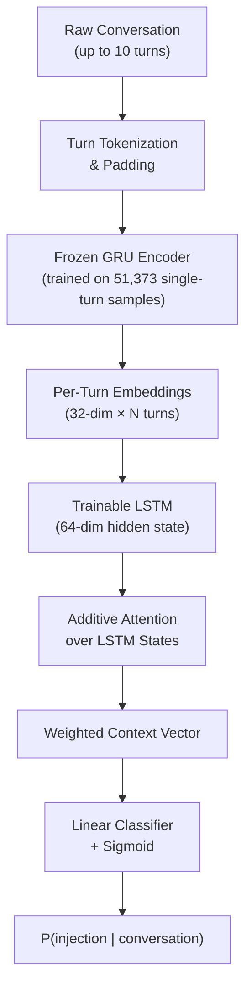

# Architecture Decisions

This document explains the architectural choices made during development of the multi-turn prompt injection detection system. Each section covers a specific decision, the alternatives considered, and the empirical or theoretical basis for the chosen approach.

---

## Overview

The system uses a dual-encoder architecture that separates two classification problems: detecting attack signals within individual turns, and detecting distributed attack patterns across a conversation.

The decomposition is deliberate. The frozen turn encoder is trained on abundant single-turn data (51,373 samples) and learns to produce informative per-message representations. The trainable sequence classifier is trained on multi-turn conversation data (27,180 v3 shared-prefix conversations) and learns to recognize conversation-level attack patterns from those representations. This separation ensures each component trains on data matched to its task, avoiding the data-starvation problem that would arise from training a single end-to-end model on multi-turn data alone.

---

## Encoder Selection

Four encoder architectures were evaluated on the single-turn classification task before the best was frozen for use in the multi-turn system.

| Iteration | Model | F1 | Notes |
|-----------|-------|----|-------|
| 1 | LSTM | 0.8143 | Random embeddings, 64-dim hidden |
| 2 | LSTM + GloVe | 0.8134 | Pretrained embeddings |
| 3 | BiLSTM + Dropout | 0.8145 | Bidirectional, dropout=0.3 |
| 4 | GRU | 0.8151 | Fewer parameters, no cell state |

GRU was selected as the encoder for three reasons. First, it achieves the highest single-turn F1 (0.8151). Second, it has fewer parameters than the LSTM variants because it eliminates the separate cell state vector, retaining only a gating mechanism over hidden state. Third, the reduced parameter count lowers computational cost at inference time, which matters when the frozen encoder runs once per turn across potentially long conversations.

The GloVe-initialized LSTM (iter 2, F1=0.8134) performed worse than randomly initialized embeddings. This result is consistent with domain mismatch: GloVe embeddings are trained on general-domain text, while prompt injection data contains specialized imperative structures and adversarial phrasing that differ substantially from the GloVe training distribution.

Dropout of 0.3 was selected from the iter 3 comparison (0.3 vs 0.5), where 0.3 produced better generalization. This value carries forward into later iterations.

---

## Chollet Heuristic Analysis

Before committing to sequence models, this project followed the heuristic from Chollet's *Deep Learning with Python* (Chapters 11 and 15): the appropriate model family for a text classification task depends on the ratio of training samples to mean sequence length.

- Training samples: 51,373
- Mean words per sample: 87.3
- Ratio = 51,373 / 87.3 = **588**
- Threshold: below 1,500 favors bag-of-bigrams models; above 1,500 sequence models become competitive; well above 1,500 transformers win

The ratio of 588 falls well below the sequence-model threshold. The following results confirm this:

| Model Family | Best F1 | Parameters |
|-------------|---------|------------|
| TF-IDF + Random Forest (BoW) | 0.834 | n/a |
| GRU (sequence) | 0.815 | 2.6M |
| Custom Transformer | 0.808 | 2.8M |
| DistilBERT (99K trainable) | 0.806 | 66M total |

The bag-of-words baseline outperforms all neural approaches on single-turn classification. The Custom Transformer uses 2,833,281 parameters; DistilBERT has 66M total parameters with 98,561 trainable during fine-tuning.

The practical conclusion: model family selection should follow the data, not current trends. At a ratio of 588, investing in transformer architectures yields no benefit over a well-tuned TF-IDF + Random Forest pipeline on single-turn data. The value of deep learning in this project emerges only in the multi-turn setting, where temporal patterns across a conversation cannot be captured by bag-of-words features regardless of how the features are weighted.

---

## Multi-Turn Architecture

All multi-turn results below are on the v3 shared-prefix test set (5,130 conversations, 4 difficulty tiers, balanced labels). 95% bootstrap CIs from 1,000 resamples.

| Model | F1 | 95% CI | Trainable Params |
|-------|:--:|:------:|:----------------:|
| **Concatenated DistilBERT** | **0.992** | [0.989, 0.994] | 66.4M |
| Hierarchical DistilBERT | 0.976 | [0.971, 0.980] | 5.5M |
| Continuation-only LSTM | 0.846 | [0.835, 0.856] | 27K |
| Autoencoder encoder | 0.845 | [0.834, 0.856] | 27K |
| Iter 6 (+attention) | 0.837 | [0.825, 0.848] | 29K |
| Iter 5 (temporal LSTM) | 0.837 | [0.826, 0.847] | 27K |
| Shuffled turns | 0.760 | [0.748, 0.772] | 27K |
| Mean pool | 0.755 | [0.743, 0.768] | 27K |
| Max pool | 0.719 | [0.705, 0.733] | 27K |
| Cosine baseline | 0.612 | [0.596, 0.627] | 0 |

The temporal LSTM (iter 5) significantly outperforms per-turn voting baselines: +13.1 F1 points over max-vote (p < 0.001). Shuffling turns drops F1 by 7.7 points (p < 0.001), confirming that turn order carries genuine signal.

Concatenated DistilBERT achieves the highest absolute F1 (0.992) with 66.4M trainable parameters — a 2,460x parameter ratio over the temporal LSTM. This gap has two interpretations: the DistilBERT models have full text access and can exploit both temporal and vocabulary signals, including residual vocabulary differences that the confound gates flagged. The temporal LSTM operates in a compressed 32-dimensional embedding space where vocabulary is compressed away. The comparison that matters is not "does the LSTM beat DistilBERT" (it does not) but "does temporal modeling add value beyond per-turn classification" (it does, significantly), and "can we deploy efficiently?" (the 27K model runs on edge devices where DistilBERT is impractical).

Design details of the lightweight temporal architecture:

- The frozen GRU encoder produces **32-dimensional** turn embeddings (half the 64-dim hidden state, via a projection layer).
- The trainable sequence LSTM reads up to **10 turns** per conversation with a **64-dimensional hidden state**.
- The sequence classifier has approximately **27,000 trainable parameters**.
- The frozen GRU parameters are not updated during multi-turn training, preventing catastrophic forgetting of single-turn features.

---

## Attention Mechanism

The sequence LSTM is augmented with additive (Bahdanau-style) attention over its hidden states. At each position in the conversation, the attention mechanism computes a scalar importance weight. The weighted sum of hidden states forms the context vector passed to the classifier.

On the v3 evaluation, attention adds negligible F1 improvement (+0.0003, p = 0.453, not statistically significant). Its primary value is interpretability: security analysts can inspect the per-turn attention weights to understand which messages most influenced a detection decision, supporting triage and response workflows. The lack of accuracy gain suggests that the temporal LSTM's hidden state already captures the discriminative signal, and attention primarily redistributes the weighting without recovering new information.

The attention module is implemented in `src/models/attention.py`.

---

## Threshold Tuning

In security applications, false negatives (missed attacks) carry substantially higher operational cost than false positives (false alarms requiring analyst review). The default decision threshold of 0.5 treats both error types equally, which is inappropriate for this domain.

Threshold tuning was explored during the initial (v1) evaluation phase. On the v1 test set, the optimal threshold of 0.64 improved F1 from 0.992 to 0.995. The v3 evaluation uses the default 0.5 threshold across all models for fair comparison, as the shared-prefix design changes the decision landscape. Per-tier performance on the v3 test set for the temporal LSTM:

| Tier | Iter 5 F1 | Iter 6 F1 | DistilBERT-concat F1 | n |
|------|:---------:|:---------:|:--------------------:|--:|
| Easy | 0.872 | 0.876 | 0.994 | 1,462 |
| Medium | 0.828 | 0.832 | 0.991 | 1,414 |
| Hard | 0.828 | 0.830 | 0.994 | 1,394 |
| Adversarial | 0.802 | 0.786 | 0.985 | 860 |

The adversarial tier — conversations specifically designed to evade detection — shows the most pronounced gap between the lightweight LSTM and DistilBERT.

---

## Ablation Studies

Seven ablation variants are implemented in `src/models/ablations.py` to establish which components of the architecture are necessary for strong performance.

| Ablation | What It Tests |
|----------|---------------|
| Shuffled turns | Whether turn order matters (random permutation at test time) |
| Reversed turns | Whether attack directionality matters |
| Mean pooling | LSTM replaced with mean of turn embeddings |
| Max pooling | LSTM replaced with max of turn embeddings |
| Autoencoder | Unsupervised turn representations vs supervised GRU |
| Prefix-only | Detection using only the first N turns |
| Continuation | Detection using only the last N turns |

The shuffle and reversal ablations are the most theoretically important. A model that learns genuine temporal patterns should degrade when turn order is destroyed. A model relying on lexical features of individual turns should be unaffected. The pooling ablations establish the contribution of the recurrent sequence model over simpler aggregation strategies.

---

## Confound Gates

Before trusting the multi-turn model's performance numbers, seven confound gates validate the data quality and check for shortcut learning. Results from `results/v3_evaluation/confound_gates.json`:

| Gate | F1 (5-fold) | Threshold | Pass? | What It Tests |
|------|:-----------:|:---------:|:-----:|---------------|
| First-turn only | 0.354 | < 0.58 | PASS | Early-turn confound |
| Conversation length | 0.482 | < 0.55 | PASS | Length confound |
| Max-vote BoW | 0.684 | < 0.70 | PASS | Per-turn voting signal |
| Unigram BoW | 0.938 | < 0.60 | FAIL | Vocabulary confound |
| Bigram BoW | 0.945 | < 0.65 | FAIL | Vocabulary confound |
| Last-turn only | 0.963 | < 0.65 | FAIL | Last-turn leakage |
| Mean-vote BoW | 0.926 | < 0.65 | FAIL | Vocabulary confound |

The shared-prefix design successfully eliminates early-turn and length confounds (first-turn F1 = 0.354, length F1 = 0.482 — both near chance). Vocabulary differences persist in post-branch turns: both attack and benign continuations use different vocabulary to complete coherent narratives after the shared prefix diverges. The 7.7-point F1 drop when turns are shuffled (0.837 → 0.760, p < 0.001) confirms that temporal signal operates on top of this residual vocabulary confound.

**Implementation**: `src/data/confound_gates.py` (gate logic), `src/data/shared_prefix_generator.py` (matched pair generation).

---

## Data Design Decisions

Multi-turn injection conversations are synthetic, generated using four strategies based on published research on adversarial prompt patterns.

| Strategy | V3 Distribution | Test Samples | Iter 5 F1 | Description |
|----------|:---------------:|:------------:|:---------:|-------------|
| Fragment distribution | ~45% | 1,160 | 0.776 | Split injection payload across turns, interleave with benign |
| Gradual escalation | ~25% | 669 | 0.676 | Crescendo pattern (Russinovich et al., USENIX Security 2025) |
| Context priming | ~15% | 372 | 0.628 | Establish persona or authority, exploit in later turns |
| Instruction layering | ~15% | 364 | 0.605 | Cumulative constraint override across turns |

Performance degrades as attack patterns become more subtle: fragment distribution (visible clues spread across turns) achieves 77.6% F1, while instruction layering (incremental constraint injection with minimal surface-level cues) achieves 60.5% F1.

The synthetic data went through three generations:
- **V1**: Template-based generation (7,000 conversations, 4 strategies at 40/30/20/10 distribution)
- **V2**: Added topic diversity and harder examples to reduce template memorization risk
- **V3 (shared-prefix)**: 27,180 conversations organized into 4 difficulty tiers (easy, medium, hard, adversarial). Each conversation pair shares identical opening turns, forcing discrimination based on how the conversation diverges. This is the authoritative evaluation dataset.

The choice to use synthetic rather than collected data was driven by availability: no large-scale labeled corpus of multi-turn prompt injection conversations exists in the open literature as of this writing. The evaluation protocol — 7 confound gates, per-tier breakdown, bootstrap CIs, paired significance tests — is designed to compensate for the distribution gap that synthetic data introduces.
